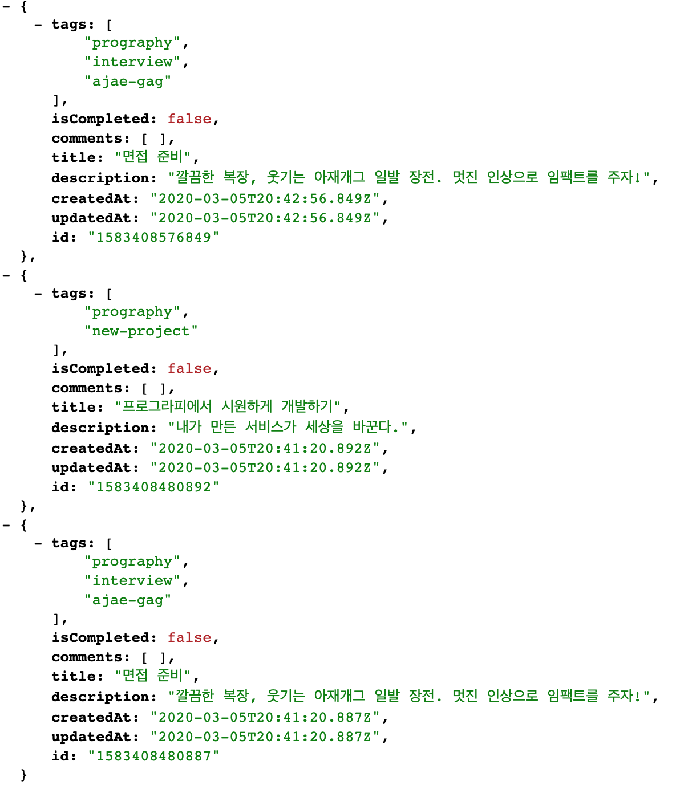
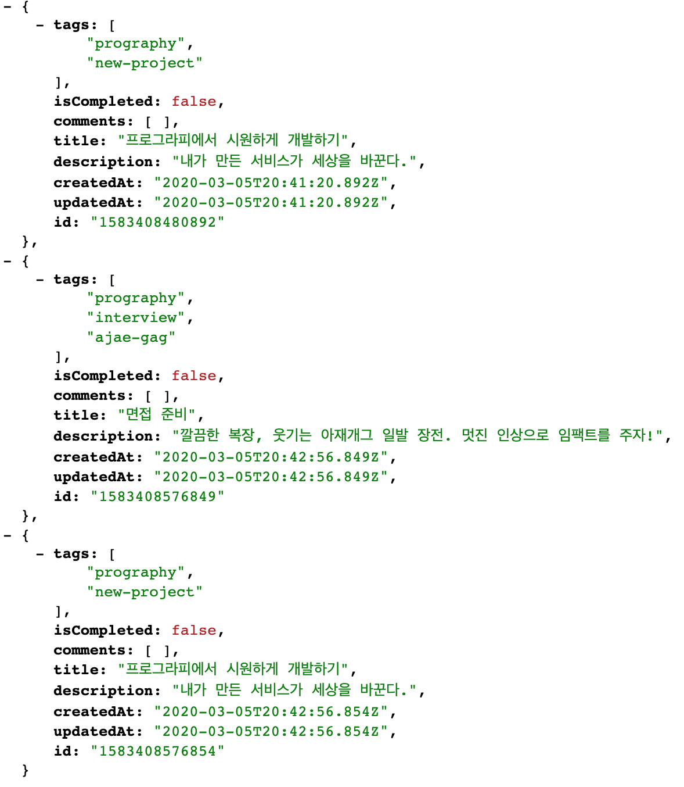
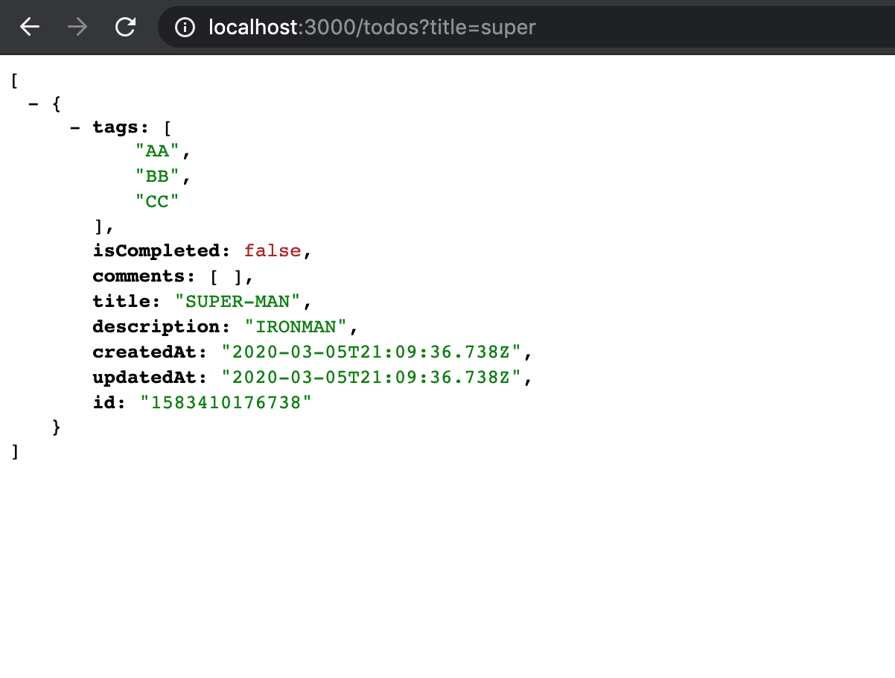
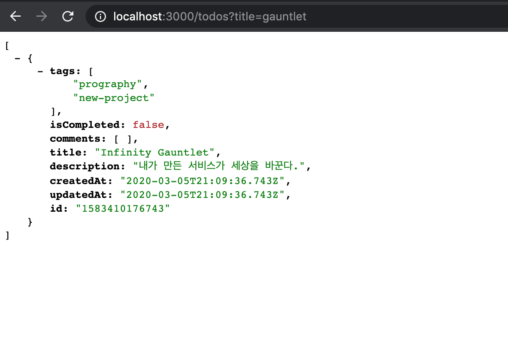
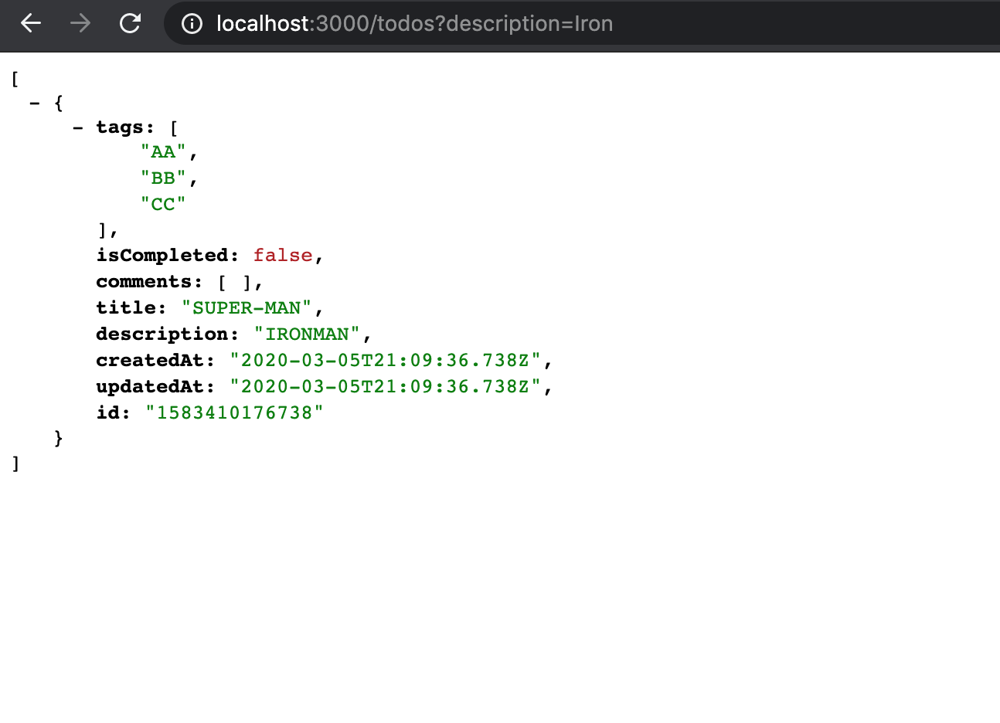
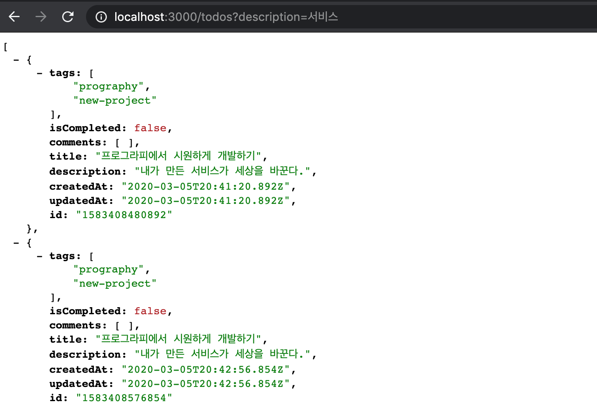
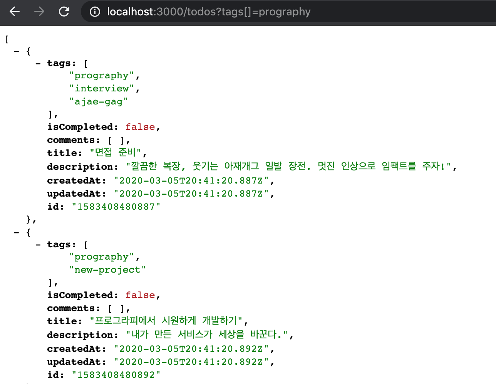
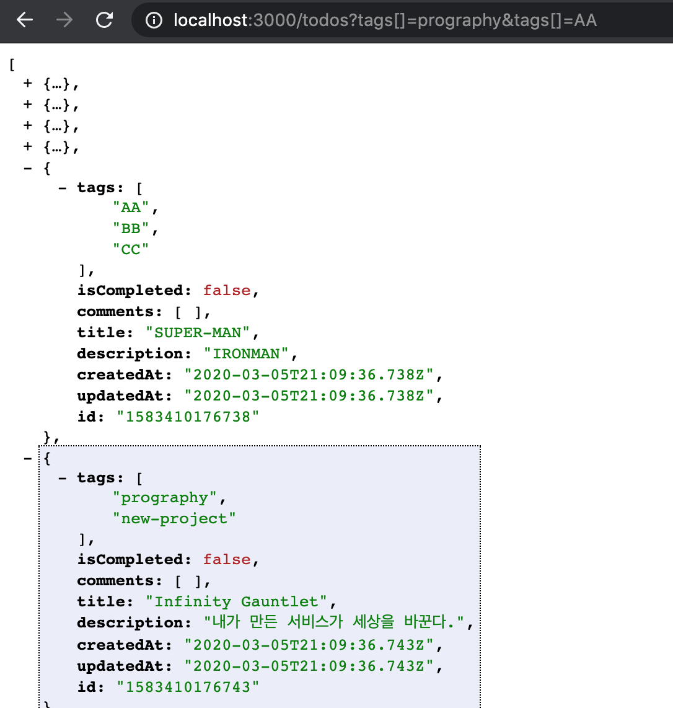

# API List

- [할일]
  - [✅ 등록]
  - [✅ 목록]
  - [✅ 읽기]
  - [✅ 수정]
  - [✅ 완료]
  - [✅ 삭제]
- [댓글]
  - [✅ 등록]
  - [✅ 목록]
  - [✅ 읽기]
  - [✅ 수정]
  - [✅ 삭제]
- [추가기능](##추가기능)
  - [✅ 정렬](###정렬)
  - [✅ 검색1](###검색)
  - [✅ 검색2](###검색)
  - [✅ 검색3](###검색)

## 추가기능

### 정렬

#### 요청
```
GET {{API_URL}}/todos?order[createdAt]=desc
```
| 파라미터               | 파라미터 유형 | 데이터 타입   | 필수 여부 | 설명       |
| ------------------ | ------- | -------- | ----- | -------- |
| `order[createdAt]` | `query` | `string` | ✅     | 생성날짜로 정렬 |

#### 응답 예시
<div style="display:flex margin-right:10px">
  
  
</div>

### 검색

#### 요청
```
GET /todos?title=과제
```
| 파라미터          | 파라미터 유형 | 데이터 타입   | 필수 여부 | 설명      |
| ------------- | ------- | -------- | ----- | ------- |
| `title`       | `query` | `string` | ✅     | 제목으로 검색 |
| `description` | `query` | `string` | ✅     | 설명으로 검색 |
| `tags`        | `query` | `string` | ✅     | 태그로 검색  |

#### 응답 예시
<div>
  <h5>Title</h5>
  <div style="display:flex margin-right:10px">
    
    
  </div>
  <h5>Description</h5>
  <div style="display:flex margin-right:10px">
    
    
  </div>
  <h5>Tags</h5>
  <div style="display:flex margin-right:10px">
    
    
  </div>
</div>